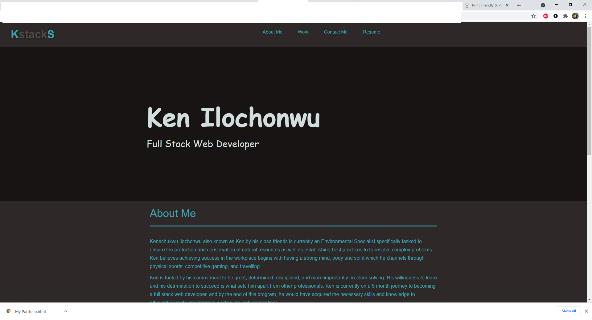

# Professional Portfolio 

**Version 1.1.0**

**My professional portfolio.**

The aim of this project is to create a professional portfolio  that showcases my skills and knowledge in web development and improve the overall user experience when assessing different features of this portfolio. This is very important becuase it engages the employers and it also ensures web accessibility. More importantly, creating a portfolio is also essential in growing or starting a business. Using the appropriate elments, classes and id selectors, users are able to navigate to each section of the page. Also, introducing the proper styling, employers are able to understand different sections as well as the ease to navigate to different pages within the portfolio. Understanding the need of accessibility is vital as there are many devices some smaller than others to vew information. So i have set up three sizes that is likely to meet most devices available to day. While this portfolio is subject to change and improvement, it is fully functional and shows major information relating to me.

## Built With

- HTML
- CSS

## Work Completed

**Creating a professional portfolio by adding the following:**

- [x]Semantic HTML elements
- [x]Elements follow logical structure independent styling and positioning
- [x]Adding alt attributes
- [x]Heading attributes fall in sequential order
- [x]adding a descriptive title
- [x]adding media query to view portfolio on multiple devices regardless of size

## Project Visual

## Contributors

- Kenechukwu K Ilochonwu <keneilo91@yahoo.com>

## Licence & Copyright

© Kenechukwu K Ilochonwu, Web Project Design

Licensed under the [LICENSE] (MIT LICENSE)

